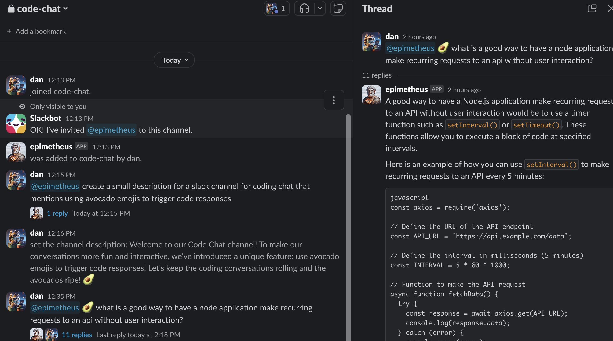

# AI Powered Slack Bot

This Slack Bot is powered by various AI models depending on emojis sent with 
the message. I'm using Mistrial AI for text and code, but Open AI for image
generation.

    
    
    
    
    
    

Messages received with an avocado :avocado: emoji will be sent through
a code based model, in this case Codestral. If it has a camera :camera:
emoji, it will generate an image.

To provide feedback to the user, typing status is no longer available on
the slack api. To get around this, a reaction of :thinking_face: is added
then a reaction of :rocket: is added after successful AI response.

## Requirements

- It is set up to run on Vercel and Redis

## Based

Originally, this was based on Vercel's slackbot. Some code from 
them still exists. Namely the slack interaction in events.ts

https://github.com/vercel/examples/tree/main/solutions/slackbot

